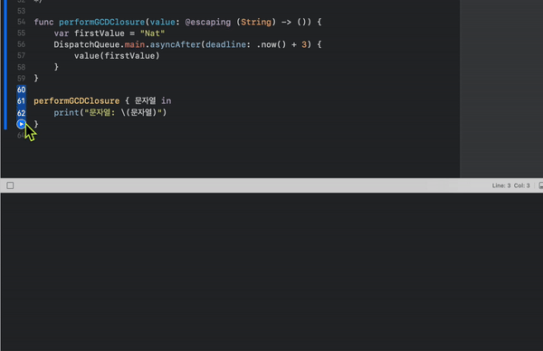

### Escaping Closure

함수에 인수로 클로저를 전달하지만 반환 후 호출되는 클로저를 함수를 탈출하다(escape)라고 한다.
이 클로저의 탈출을 허락한다는 의미로 파라미터의 타입 전에 @escaping 을 작성할 수 있다.
함수가 끝나면 스택에 저장했던 것이 사라지는데, @escaping 키워드를 클로저 앞에 붙이면, 유지시킬 수 있다. 

또한, 비동기 코드를 사용해야 할 때도 사용한다.

```Swift
var completionHandlers: [() -> Void] = []
func someFunctionWithEscapingClosure(completionHandler: @escaping () -> Void) {
    completionHandlers.append(completionHandler)
}
```

비동기 코드를 적용하고 싶을 때

```Swift
func performGCDClosure(value: @escaping (String) -> ()) {
    var firstValue = "Nat"
    DispatchQueue.main.asyncAfter(deadline: .now() + 3) {
        value(firstValue)
    }
}

performGCDClosure { 문자열 in
    print("문자열: \(문자열)")
}
```
3초 뒤에 디버깅 창에 문자열에 관련된 변수에 담긴 데이터가 출력되는 것을 확인할 수 있었다. 


