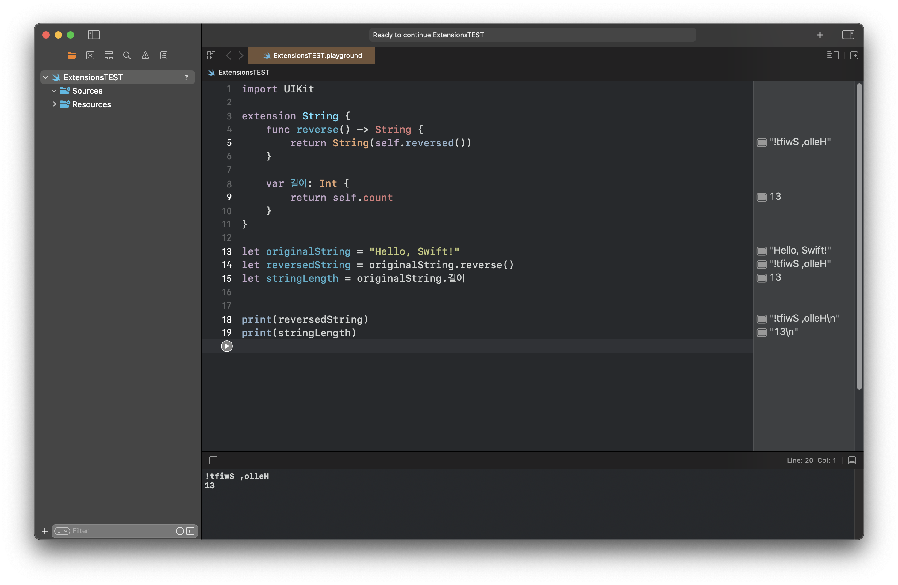

# Extension에 대해 설명하시오.
기존의 클래스, 구조체, 열거형 프로토콜 등에 새로운 기능을 추가하는 데 사용되는 기능.
-> 기존 소스코드에 접근 권한이 없는 타입을 확장하는 기능을 포함

> Swift Extension 을 사용하는 주요 목적<br>

**1. 기능 추가 및 모듈화<br>**
기존 타입을 수정하지 않고도 새로운 기능을 추가할 수 있고, 이는 기능을 모듈화해 코드를 더 깔끔하고 유지보수하기 쉽게 만든다.<br> 
**2. 프로토콜 채용<br>**
 이미 구현된 타입이 특정 프로토콜을 따르도록 만들고 싶을 때, 확장을 사용해 프로토콜을 채용할 수 있다.<br> 
**3. 코드 가독성 향상<br>**
 비슷한 기능을 하는 메서드나 속성을 한 곳에 모아둬 가독성을 향상시킬 수 있다. 또한, 동일한 기능이 여러 곳에서 필요한 경우 중복 코드를 피할 수 있다. 

 요약하자면 
Swift Extensions 은 아래 것들을 수행
- computed instance property 와 computed type property 추가
- instance method와 type method 를 정의
- 새로운 initializer 제공
- subscript 정의
- 새로운 중첩 타입 정의 사용
- 기존 타입이 프로토콜을 준수하도록 함

### Extension Syntax(확장 구문)

```swift
extension SomeType {
	// new functionality to add to SomeType goes here 
}
```

확장은 하나 이상의 프로토콜을 채택해 기존 타입을 확장할 수 있다. 프로토콜 준수를 추가할 때 클래스 또는 구조체를 작성하는 것과 동일한 방법으로 프로토콜 이름을 작성한다.

```swift
extension: SomeProtocol, AnotherProtocol {
	// implementation of protocol requirements goes here 
}
```

원본 코드는 그대로 두고, 원하는 기능을 해당 타입에 확장하는 것.
```Swift
extension String {
    func reverse() -> String {
        return String(self.reversed())
    }
    
    var 길이: Int {
        return self.count
    }
}

let originalString = "Hello, Swift!"
let reversedString = originalString.reverse()
let stringLength = originalString.길이


print(reversedString)
print(stringLength)
```


코드를 더 모듈화하고 가독성을 향상시키며, 새로운 기능을 추가할 때 기존 코드를 수정하지 않아도 된다는 장점을 얻을 수 있다.

예를 들어, 폰트를 컴포넌트화해서 가지고와서 사용할 수 있다. 그 외 컬러도 확장으로 커스텀 컬러를 지정해서 사용할 수 있고 재사용성에도 좋고 오타날 일도 줄어든다. 

그 외 기존 타입에서 새로운 기능인 Scroll기능을 넣고 싶을때 

```Swift
extension ViewController: UIScrollViewDelegate {
	func scrollViewDidScroll(_ scrollView: UIScrollView) {
		if scrollView.contentOffset.x > 0 {
			scrollView.contentOffset.x = 0
		}
	}
}
```
delegate 를 추가할 때도 쓴다. 

