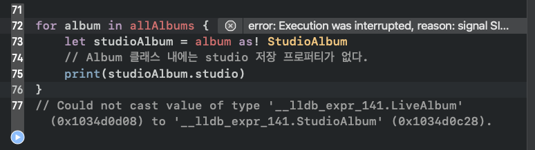
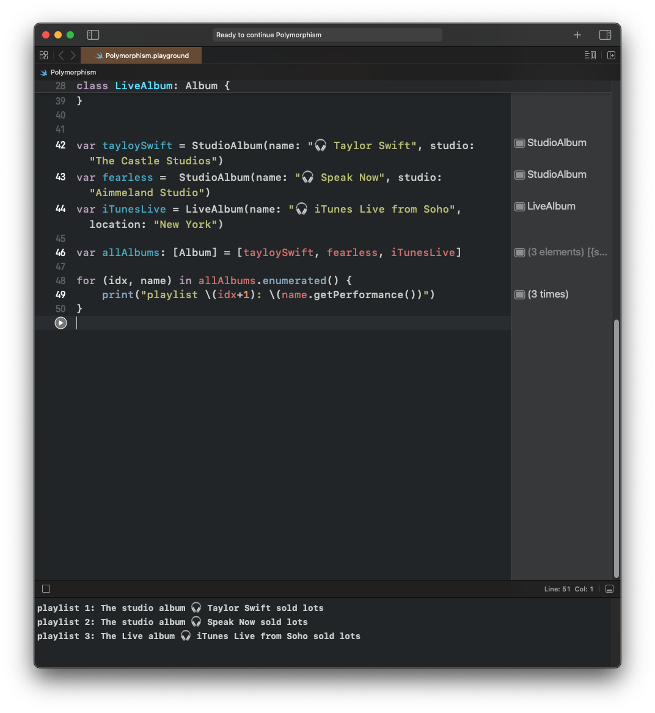

# 타입 변환(Type Casting)과 다형성(Polymorphism)에 대해 설명해보세요.

둘 다 클래스의 상속과 연관된 특성이다. 
## Type Casting(타입변환)
예를 들어, 클래스 B는 A의 타입으로 클래스 인스턴스가 생성 가능하다. 그럴 경우엔 메서드가 있다면 overriding(재정의)해서 사용도 가능하다. <br>
그리고 그 인스턴스에 접근하게 될 때에는 **실패할 가능성**을 생각해 다운캐스팅(`as?` 또는 `as!` 강제 언래핑) 을 해준다. <br>
`as?` 을 할 경우에는 **성공할 때**에는 Optional 값을 던지고, **실패할 경우**에는 nil 을 반환하게 된다. 

> 실패 가능한 경우 대비한 다운캐스팅
```Swift
for album in allAlbums {
    print("===")
    print(album.getPerformance())
    if let studioAlbum = album as? StudioAlbum {
        print(studioAlbum.studio)
    } else if let liveAlbum = album as? LiveAlbum {
        print(liveAlbum.location)
    }
}
```

강제적으로 했을 때 에러가 남.
```Swift
for album in allAlbums {
    let studioAlbum = album as! StudioAlbum
    // Album 클래스 내에는 studio 저장 프로퍼티가 없다.
    print(studioAlbum.studio)
    print(type(of: studioAlbum.studio))
}
// Could not cast value of type '__lldb_expr_141.LiveAlbum' (0x1034d0d08) to '__lldb_expr_141.StudioAlbum' (0x1034d0c28).
```


> **Upcasting 의 경우**도 있는데 B클래스를 상속받은 A가 B타입으로 인스턴스를 생성할 경우 


접근할때는 항상 값이 100% 존재함으로  타입캐스팅은 항상 성공해서 그냥 as 만 해주면 된다. 

> 그 외에 변수나 상수가 그 **특정 클래스 타입인지 아닌지 확인할 때**는 `is` 타입을 사용해 true 인지 false 인지 가려낸다.

### Type Casting 으로 타입 변환
특정 유형 객체를 가지고 있지만 실제로는 다른 유형이라는 것을 알고 있는 경우가 종종 있다. Swift 는 사용자가 알고 있는 것을 모른다면 코드 빌드를 하지 않음. 

→ 해결책: 한 타입의 객체를 다른 타입으로 변환하는 타입 캐스팅

### 생성자를 사용한 일반적 타입 변환
데이터타입이 완전히 다른 것은 type casting 할수가 없다. 
```Swift
let number = 5
let text = number as! String
// Cast from 'Int' to unrelated type 'String' always fails

let text = String(number) as! String
```
항상 실패한다는 메시지가 뜰 것이다. 하지만 String(number) 으로 씌워준다면 가능한다.

---
## 다형성(polymorphism)
클래스는 서로 상속할 수 있기 때문에 한 클래스는 사실상 다른 클래스의 상위 집합이다. 즉 클래스 B는 클래스 A가 가진 모든 것을 가지고 있으며 몇가지 추가 기능이 있다.<br>
 이는 다시 말해 필요에 따라 B를 타입 B로 취급하거나 A 로 취급할 수 있음을 의미한다.

 ```Swift
 class Album {
    var name: String
    
    init(name: String) {
        self.name = name
    }
}

class StudioAlbum: Album {
    var studio: String
    
    init(name: String, studio: String) {
        self.studio = studio
        super.init(name: name)
    }
}

class LiveAlbum: Album {
    var location: String
    
    init(name: String, location: String) {
        self.location = location
        super.init(name: name)
    }
}


var tayloySwift = StudioAlbum(name: "Taylor Swift", studio: "The Castle Studios")
var fearless =  StudioAlbum(name: "Speak Now", studio: "Aimmeland Studio")
var iTunesLive = LiveAlbum(name: "iTunes Live from Soho", location: "New York")

var allAlbums: [Album] = [tayloySwift, fearless, iTunesLive]
 ```

 앨범만 보관하는 배열을 만들고 그 안에 두 개의 정규 앨범과 라이브 앨범을 넣는다. 앨범은 모두 Album 클래스의 하위 클래스이므로 기본 동작이 동일하기 때문에 Swift 에는 문제가 없다. 

 다형성의 동작 케이스

 ```Swift
 class Album {
    var name: String
    
    init(name: String) {
        self.name = name
    }
    
    func getPerformance() -> String {
        return "The album \(name)sold lots"
    }
}

class StudioAlbum: Album {
    var studio: String
    
    init(name: String, studio: String) {
        self.studio = studio
        super.init(name: name)
    }
    
    override func getPerformance() -> String {
        return "The studio album \(name) sold lots"
    }
}

class LiveAlbum: Album {
    var location: String
    
    init(name: String, location: String) {
        self.location = location
        super.init(name: name)
    }
    
    override func getPerformance() -> String {
        return "The Live album \(name) sold lots"
    }
}


var tayloySwift = StudioAlbum(name: "🎧 Taylor Swift", studio: "The Castle Studios")
var fearless =  StudioAlbum(name: "🎧 Speak Now", studio: "Aimmeland Studio")
var iTunesLive = LiveAlbum(name: "🎧 iTunes Live from Soho", location: "New York")

var allAlbums: [Album] = [tayloySwift, fearless, iTunesLive]

for (idx, name) in allAlbums.enumerated() {
    print("playlist \(idx+1): \(name.getPerformance())")
}
 ```

 


 해당 하위 클래스에 따라 자동으로 getPerformance() 의 오버라이드 버전이 사용된다. 

하나의 객체가 그 클래스와 부모 클래스로 동시에 작동될 수 있다

[참고문서](https://www.hackingwithswift.com/read/0/20/polymorphism-and-typecasting)
