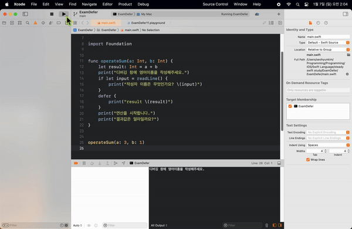
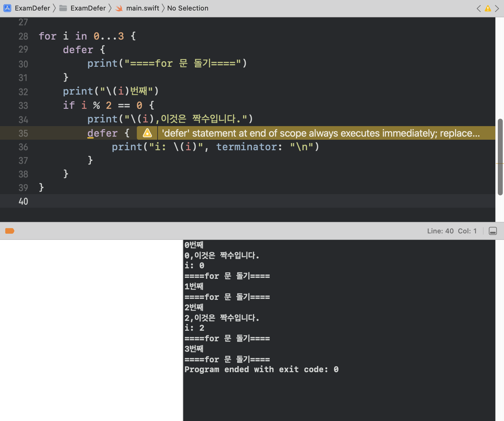
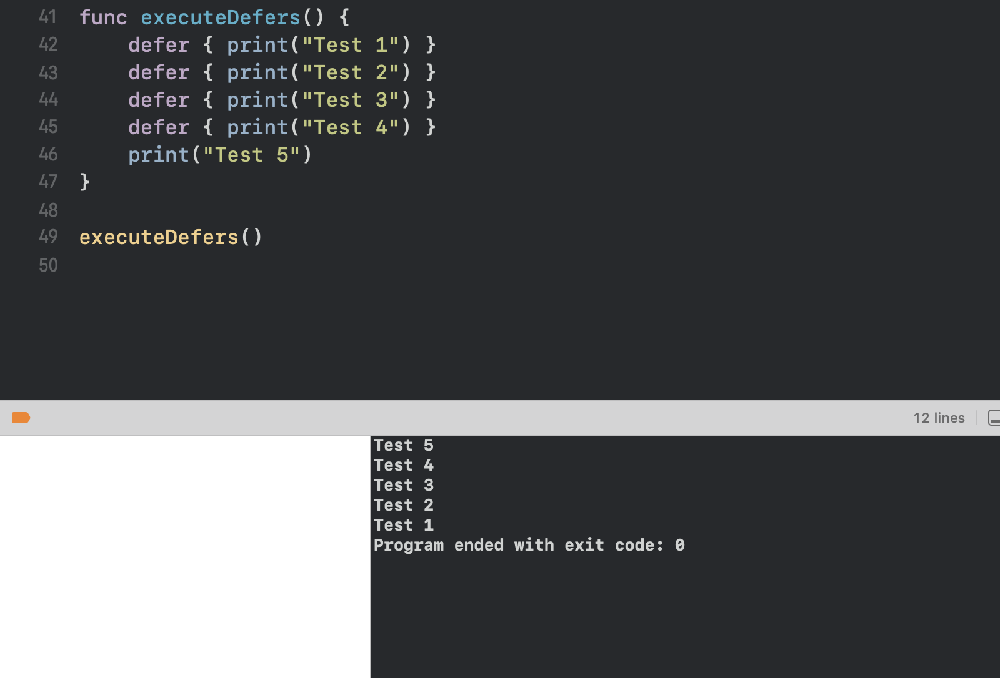

## defer란 무엇인지 설명하시오.

사전적 정의로는 defer 는 미루다, 연기하다 의 뜻이 있다.
작성된 위치와 상관없이 함수 종료 직전에 실행되는 구문
실행을 함수의 마지막으로 미룸 

```Swift
func operateSum(a: Int, b: Int) {
    let result: Int = a + b
    print("디버깅 창에 영어이름을 작성해주세요.")
    if let input = readLine() {
        print("작성자 이름은 무엇인가요? \(input)")
    }
    defer {
        print("result \(result)")
    }
    print("연산을 시작합니다.")
    print("결과값은 얼마일까요?")
}


operateSum(a: 3, b: 1)
```

### compile 런(실행) 후 


함수 내 순서와 관련없이 defer 내 결괏값이 가장 마지막에 실행되는 것을 볼 수 있다.

```Swift
for i in 0...3 {
    defer {
        print("====for 문 돌기====")
    }
    print("\(i)번째")
    if i % 2 == 0 {
        print("\(i),이것은 짝수입니다.")
        defer {
            print("i: \(i)", terminator: "\n")
        }
    }
}

```

위치 상관없이 마지막에 실행된다.


### Case 3
여러 개의 Defer 가 있을 때 실행되는 모습
```Swift
func executeDefers() {
    defer { print("Test 1") }
    defer { print("Test 2") }
    defer { print("Test 3") }
    defer { print("Test 4") }
    print("Test 5")
}

executeDefers()
```
실행 순서가 역순이기 때문에 선언된 순서의 반대로 print 되고 있는 것을 확인할 수 있다.
